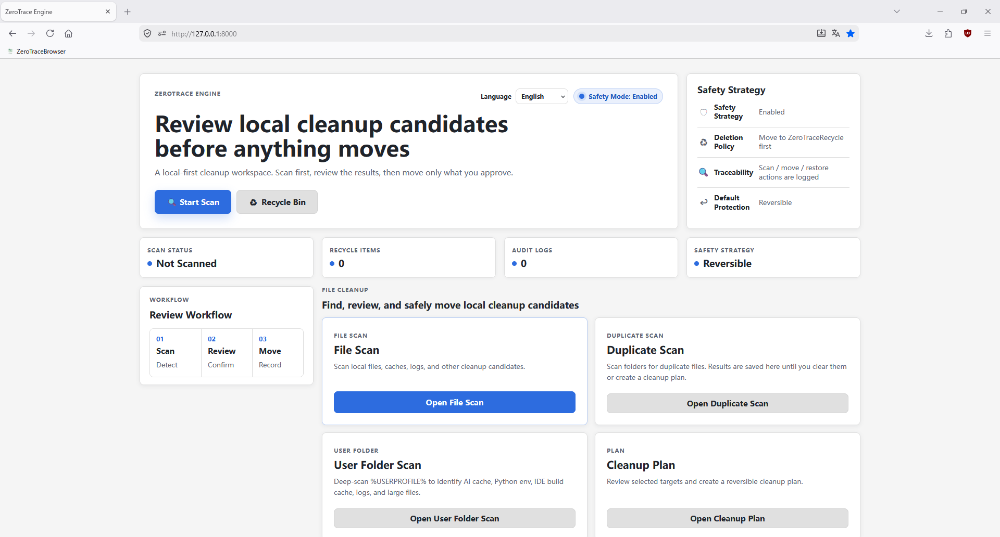
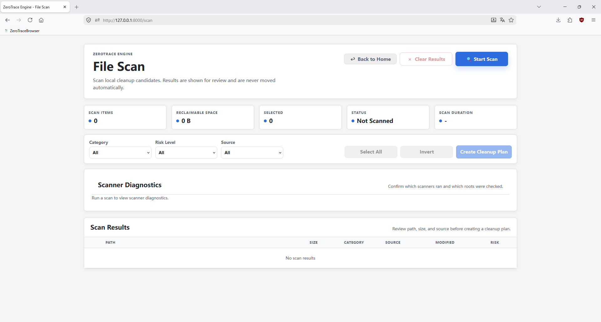
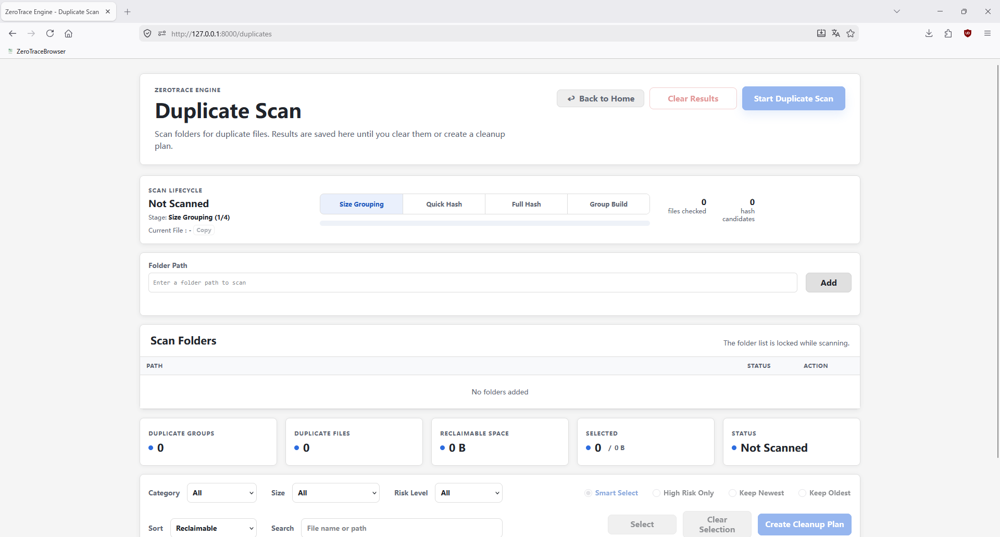
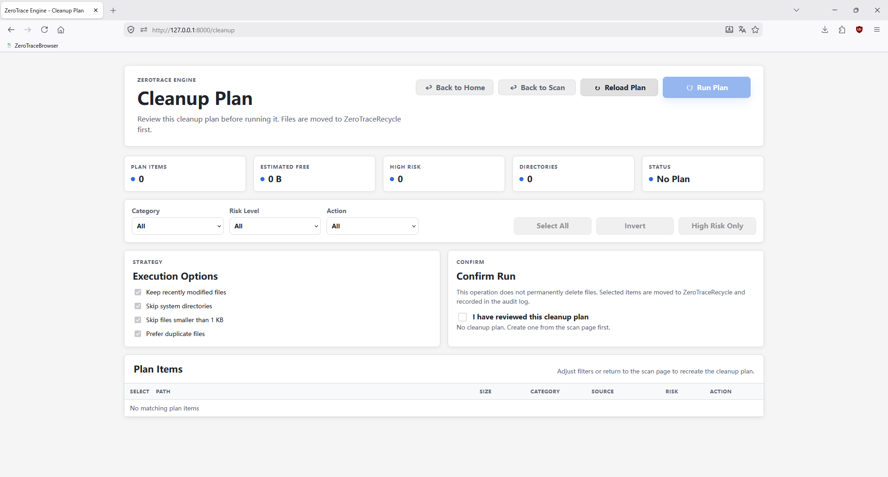
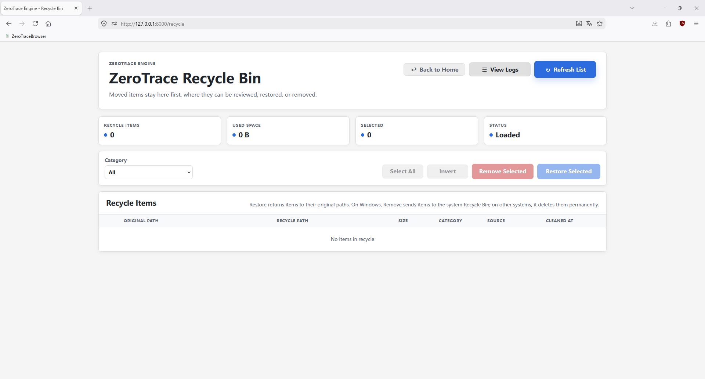
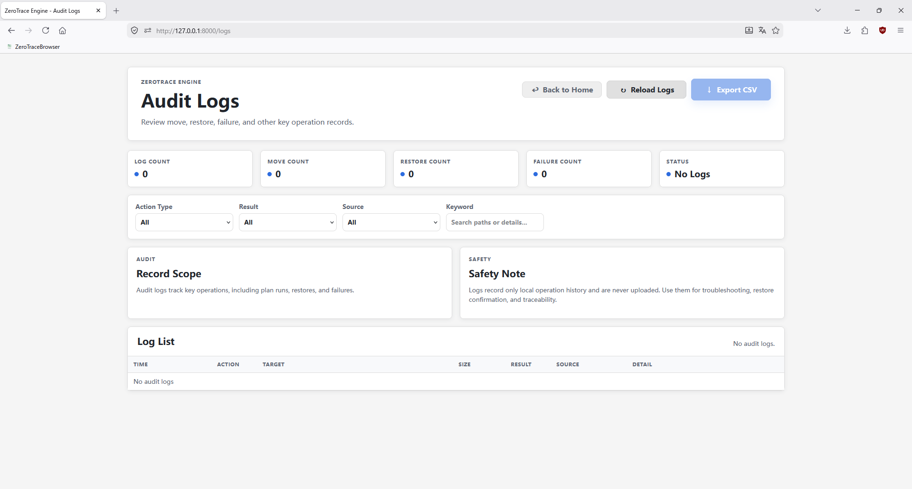

# ZeroTrace Engine

> A local, reversible operation engine for reviewing cleanup candidates and registry traces.

ZeroTrace Engine is not an automatic Windows cleanup tool. It is a local-first cleanup review workspace. Its goal is to move cleanup candidates into the project recycle area only after explicit user confirmation, export registry cleanup targets to `.reg` backups, and keep queryable, restorable operation records.

## Project Positioning

ZeroTrace Engine follows these principles:

- No black-box cleanup
- No silent operations
- No direct permanent deletion of files or registry entries
- No upload of local data
- Scan results, cleanup plans, and recycle records must be visible, confirmable, and traceable

## Current Features

### System Scan

- Scans local cleanup candidates such as temporary files, logs, thumbnail caches, Windows Update caches, empty files, and empty folders
- Shows path, size, source, category, and risk level
- Includes application leftover scan capability

### Duplicate Scan Capability

- Detects duplicate files by SHA-256 hash
- Supports common file types such as images, videos, documents, and archives
- Groups results by hash so users can choose what to keep or move
- Scan phase is read-only; approved files move into `ZeroTraceRecycle/`

### Registry Review Capability

- Scans the Windows registry for invalid, orphaned, or broken entries
- Covers six issue types: invalid path references, orphan COM objects, invalid uninstall records, invalid services, startup issues, and broken file associations
- Uses a four-stage algorithm: collect values, parse target paths, match rules, score risk
- Risk levels: Safe / Medium / High, with critical system entries explicitly marked
- Exports `.reg` backups into `ZeroTraceRegistryRecycle/` before cleanup, with one-click restore through `reg.exe import`

### Cleanup Plan And Recycle

- Generates cleanup plans from scan results
- Moves files to `ZeroTraceRecycle/` when executing a plan
- Writes registry backups to `ZeroTraceRegistryRecycle/`
- Restores files from the recycle area to their original paths
- Restores registry entries from registry backups
- Keeps complete audit logs

### Persistence

- Uses SQLite in WAL mode for scan results, cleanup plans, audit records, file hashes, and settings
- Registry data is stored in separate tables: `registry_scan_results`, `registry_cleanup_plans`, and `registry_cleanup_actions`

### Frontend

- Multi-page UI: dashboard, scan, cleanup plan, recycle bin, audit logs, duplicates, registry scan, and manual tools
- Browser-side i18n for English, Chinese, and Japanese, without backend dependency
- Native JavaScript ES6 modules, no frontend framework

## Screenshots

### Dashboard



### Scan



### Duplicates



### Cleanup Plan



### Recycle Bin



### Audit Logs



## Architecture

The current codebase is structured around these boundaries:

```text
app.py
  FastAPI mounting, router registration, and static file serving only

core/routers/
  FastAPI routes, request models, and response forwarding only

core/services/
  Business orchestration such as scan execution, cleanup plan execution, recycle restore, registry scan, and registry cleanup

core/storage/
  SQLite connection, schema creation, and repository reads/writes

core/scanners/
  Read-only detection only, returning structured ScanItem data

core/utils/
  Low-level helpers such as file transfer and recycle path generation

core/models.py
  Pydantic models for file scan flows

core/registry_models.py
  Pydantic models for registry scan flows, independent from file scan models

static/
  Frontend pages, page scripts, styles, and i18n copy
```

New features should be placed within the appropriate `core.services.*`, `core.storage.*`, and `core.scanners/` boundaries to keep routing, business logic, storage, and scanning responsibilities clear.

## Safety Rules

- File cleanup must move files into `ZeroTraceRecycle/` first. Do not use `os.remove()`, `Path.unlink()`, or `shutil.rmtree()` as normal cleanup paths.
- Registry cleanup must export a `.reg` backup into `ZeroTraceRegistryRecycle/` before calling `winreg.DeleteValue()` or `winreg.DeleteKey()`.
- Restore must check whether the original path or registry entry already exists.
- Scanners must stay read-only: no moving, deleting, or writing.
- Routers must not call file operations or database details directly.
- Database writes are centralized in the repository layer.

## Tech Stack

- Python + FastAPI
- Pydantic
- SQLite in WAL mode
- `winreg` / `pathlib` / `shutil` / `subprocess`
- Native HTML / CSS / JavaScript, no frontend framework

## Development Environment

Use the existing virtual environment. A new venv is not required:

```powershell
~\.virtualenvs\venv\Scripts\python.exe -m pip install -r requirements.txt
~\.virtualenvs\venv\Scripts\python.exe -m pip install -r requirements-dev.txt
```

Start the app:

```powershell
.\start.ps1
```

For development with reload:

```powershell
.\start-dev.ps1
```

Or directly:

```powershell
~\.virtualenvs\venv\Scripts\python.exe -m uvicorn app:app --reload
```

Default URL:

```text
http://127.0.0.1:8000
```

## Tests

```powershell
.\test.ps1
```

Or directly:

```powershell
~\.virtualenvs\venv\Scripts\python.exe -m pytest -q
```

Tests use the repo-local `.test-tmp/` directory and isolated SQLite databases to avoid touching real system directories.

## Scan Capabilities

### Temporary Directory Scan

- Scans `C:\Windows\Temp`, user `AppData\Local\Temp`, and directories pointed to by `TEMP` / `TMP`
- Deduplicates scan results
- Skips files modified within the last 24 hours by default

### Log File Scan

- Scans the repo `logs/` directory and Windows temporary directories by default
- Detects `.log`, `.old`, `.bak`, `.tmp`, and common rotated log names
- Skips files modified within the last 7 days by default

### Empty File / Empty Folder Scan

- Detects empty files and leaf empty folders only under low-risk roots
- Skips items modified within the last 24 hours by default

### Windows Update Cleanup Candidate Detection

- Detects old download caches under `C:\Windows\SoftwareDistribution\Download`
- Skips files modified within the last 14 days by default

### Thumbnail Cache Scan

- Detects Windows Explorer thumbnail caches such as `thumbcache_*.db` and `iconcache_*.db`
- Skips files modified within the last 7 days by default

### Application Leftover Scan

- Detects common folders and configuration left behind after Windows application uninstall
- Scan phase is read-only, and leftover items must enter a reversible cleanup flow

### Duplicate File Detection

- Uses two-stage hashing: quick header hash pre-filtering plus full SHA-256 confirmation
- Supports images, videos, documents, and archives

### Registry Scan

- **InvalidPath**: Run / RunOnce startup entries that reference missing paths
- **OrphanCOM**: COM object DLL / EXE files registered under `HKCR\CLSID` are missing
- **InvalidUninstall**: uninstall program paths in uninstall registry entries are missing
- **InvalidService**: executable paths in service registry entries are missing
- **StartupIssue**: startup target files are broken or paths are malformed
- **FileAssociation**: programs used by file associations are missing

> All scan phases are read-only. Cleanup moves items into the corresponding recycle area. Items can be restored from ZeroTraceEngine afterward. When removing from `ZeroTraceRecycle/`, Windows sends items to the system Recycle Bin, while other systems delete them directly.

## Runtime Directories

The following directories are local runtime state and should not be committed as source:

```text
data/                      # SQLite database files
logs/                      # Runtime logs
ZeroTraceRecycle/          # File recycle staging area
ZeroTraceRegistryRecycle/  # Registry backup .reg area
.test-tmp/                 # Test temporary directory
```

## Feature Map

The dashboard groups feature entries by purpose.

### File Cleanup

| Path | Page | Purpose | Safety Boundary |
|------|------|---------|-----------------|
| `/scan` | File Scan | Scan temporary files, logs, thumbnail caches, Windows Update caches, empty files, empty folders, and other cleanup candidates | Read-only scan; does not move files |
| `/duplicates` | Duplicate Scan | Scan selected folders for duplicate files, group by hash, and choose items to move | Read-only scan; selected items enter the cleanup plan |
| `/user-directory` | User Folder Scan | Analyze caches, environments, build outputs, logs, and large files under `%USERPROFILE%` | Read-only scan for space review and manual confirmation |
| `/cleanup` | Cleanup Plan | Summarize scan or duplicate results and run after confirmation | Moves files into `ZeroTraceRecycle/` first and keeps audit records |
| `/recycle` | Recycle Bin | Review, restore, or remove files in `ZeroTraceRecycle/` | Restore returns to original paths; Remove sends files to the system Recycle Bin on Windows and deletes directly on other systems |

### System Inspection

| Path | Page | Purpose | Safety Boundary |
|------|------|---------|-----------------|
| `/app-scan` | Application Scan | Enumerate installed applications, install folder usage, and leftover application traces | Scan phase is read-only; leftover items must enter a reversible flow |
| `/registry` | Registry Scan | Detect invalid paths, orphan COM entries, invalid uninstall records, services, startup entries, and file association issues | Exports `.reg` backups before cleanup; high-risk and diagnostic items are not executed automatically |

### Support

| Path | Page | Purpose | Safety Boundary |
|------|------|---------|-----------------|
| `/logs` | Audit Logs | Review move, restore, remove, and registry plan records | Read-only query |
| `/tools` | Manual Tools | Provide Windows settings, disk cleanup commands, and browser history entries | External tool entry points only; ZeroTraceEngine does not execute them automatically |

`/` is the dashboard. It only provides status overview and feature entry points; it does not run cleanup operations.

## Documents

- English README: [README.md](./README.md)
- Chinese README: [README_zh.md](./README_zh.md)
- Japanese README: [README_ja.md](./README_ja.md)
- Environment: [ENVIRONMENT.md](./ENVIRONMENT.md)
- Disclaimer: [DISCLAIMER.md](./DISCLAIMER.md)
- Chinese environment guide: [环境配置说明.md](./环境配置说明.md)
- Chinese disclaimer: [免责声明.md](./免责声明.md)
- Japanese environment guide: [環境設定ガイド.md](./環境設定ガイド.md)
- Japanese disclaimer: [免責事項.md](./免責事項.md)

## Roadmap

- More registry scan rules, such as MUI cache and font registration checks
- More complete audit query and filtering
- More application leftover detection rules
- Better batch operations in the recycle bin

## Philosophy

System cleanup should not be a black-box action. Users should always know what will be handled, where it has been moved, and how to restore it.

## License

This project is open source under the MIT License. See [LICENSE](./LICENSE) for details.
