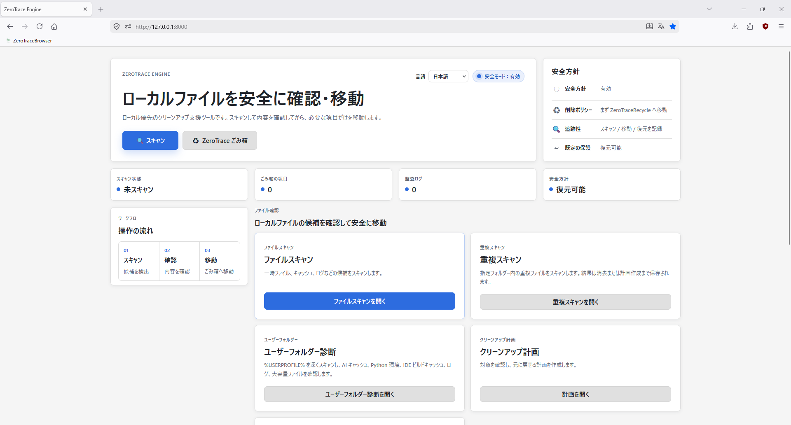
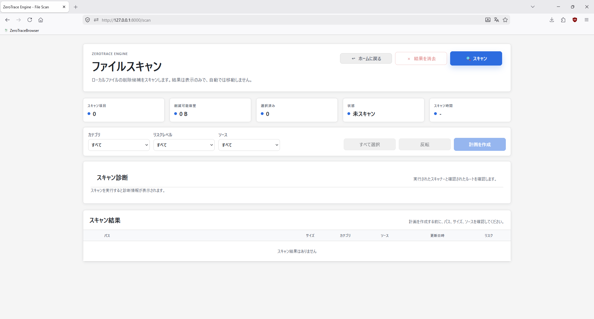
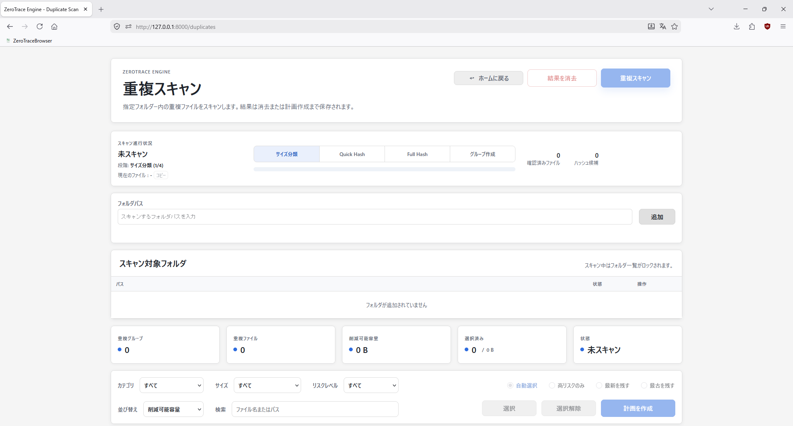
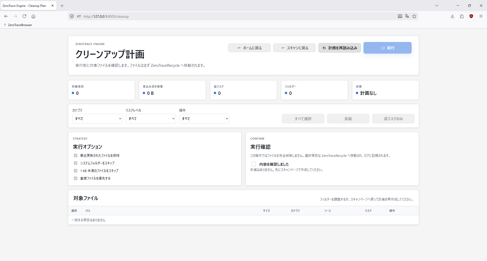
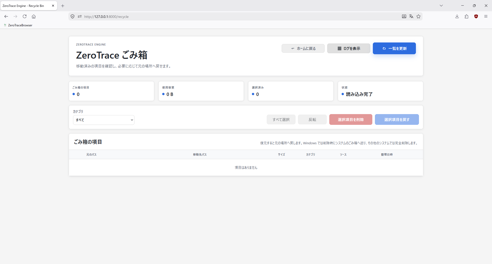
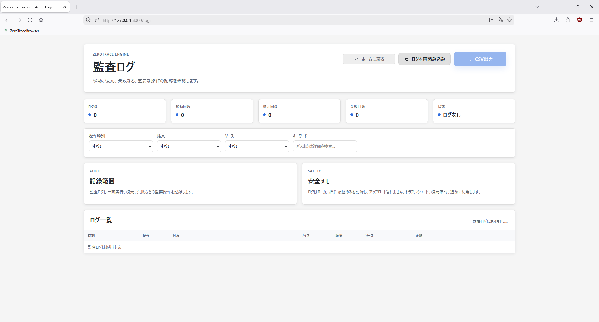

# ZeroTrace Engine

> ローカルのクリーンアップ候補とレジストリ痕跡を確認し、可能な範囲で復元できる操作エンジン。

ZeroTrace Engine は、Windows の自動クリーンアップツールではありません。ローカル優先のクリーンアップ確認ワークスペースです。ユーザーが明示的に確認した候補だけをプロジェクト内のごみ箱領域へ移動し、レジストリのクリーンアップ候補は `.reg` バックアップとして保存し、検索可能で復元しやすい操作記録を残すことを目的としています。

## プロジェクトの位置づけ

ZeroTrace Engine は次の原則に従います：

- ブラックボックス的なクリーンアップをしない
- サイレント操作をしない
- ファイルやレジストリ項目を通常フローで直接完全削除しない
- ローカルデータをアップロードしない
- スキャン結果、クリーンアップ計画、ごみ箱記録は、見えること、確認できること、追跡できることを重視する

## 現在の機能

### システムスキャン

- 一時ファイル、ログ、サムネイルキャッシュ、Windows Update キャッシュ、空ファイル、空フォルダーなどのクリーンアップ候補をスキャン
- パス、サイズ、出所、カテゴリ、リスクレベルを表示
- アプリケーションの残存データ検出に対応

### 重複ファイル検出機能

- SHA-256 ハッシュで重複ファイルを検出
- 画像、動画、文書、アーカイブなど一般的なファイル形式に対応
- ハッシュごとにグループ化し、残すファイルと移動するファイルをユーザーが選択
- スキャン段階は読み取り専用で、承認したファイルだけを `ZeroTraceRecycle/` へ移動

### レジストリ確認

- Windows レジストリ内の無効、孤立、破損した項目をスキャン
- 無効なパス参照、孤立 COM、無効なアンインストール情報、無効なサービス、スタートアップ問題、壊れたファイル関連付けを対象にする
- 値の収集、対象パスの解析、ルール照合、リスク評価の 4 段階で判定
- リスクレベルは Safe / Medium / High。重要なシステム項目は明示的に表示
- クリーンアップ前に `ZeroTraceRegistryRecycle/` へ `.reg` バックアップを出力し、`reg.exe import` による復元に対応

### クリーンアップ計画とごみ箱

- スキャン結果からクリーンアップ計画を生成
- 計画を実行すると、ファイルを `ZeroTraceRecycle/` へ移動
- レジストリバックアップを `ZeroTraceRegistryRecycle/` へ保存
- ごみ箱領域から元のパスへファイルを復元
- レジストリバックアップからレジストリ項目を復元
- 操作ログを記録

### 永続化

- SQLite（WAL モード）でスキャン結果、クリーンアップ計画、監査記録、ファイルハッシュ、設定を保存
- レジストリ関連データは `registry_scan_results`、`registry_cleanup_plans`、`registry_cleanup_actions` の独立したテーブルで管理

### フロントエンド

- ダッシュボード、スキャン、クリーンアップ計画、ごみ箱、監査ログ、重複ファイル、レジストリスキャン、手動ツールの複数ページ構成
- バックエンドに依存しない英語・中国語・日本語のブラウザー側 i18n
- フロントエンドフレームワークを使わない、通常の JavaScript ES6 modules

## 画面スクリーンショット

### ダッシュボード



### スキャン



### 重複ファイル



### クリーンアップ計画



### ごみ箱



### 監査ログ



## アーキテクチャ

現在のコードベースは次の境界で構成されています：

```text
app.py
  FastAPI のマウント、ルーター登録、静的ファイル配信のみ

core/routers/
  FastAPI ルート、リクエストモデル、レスポンス転送のみ

core/services/
  スキャン実行、クリーンアップ計画実行、ごみ箱復元、レジストリスキャン、レジストリクリーンアップなどの業務処理

core/storage/
  SQLite 接続、スキーマ作成、repository の読み書き

core/scanners/
  読み取り専用の検出処理。構造化された ScanItem を返す

core/utils/
  ファイル移動、回収先パス生成などの低レベル補助機能

core/models.py
  ファイルスキャン用の Pydantic モデル

core/registry_models.py
  レジストリスキャン用の Pydantic モデル。ファイルスキャンモデルとは独立

static/
  フロントエンドページ、ページスクリプト、スタイル、i18n 文言
```

新しい機能は、ルート層、業務層、保存層、スキャン層の責務を分けるため、該当する `core.services.*`、`core.storage.*`、`core.scanners/` の境界内に配置します。

## 安全ルール

- ファイルクリーンアップは、まず `ZeroTraceRecycle/` へ移動する。通常のクリーンアップ経路で `os.remove()`、`Path.unlink()`、`shutil.rmtree()` を使わない
- レジストリクリーンアップは、`winreg.DeleteValue()` または `winreg.DeleteKey()` の前に `.reg` バックアップを `ZeroTraceRegistryRecycle/` へ出力する
- 復元前に、元のパスまたはレジストリ項目が既に存在しないか確認する
- スキャナーは読み取り専用を維持し、移動、削除、書き込みをしない
- ルーターからファイル操作やデータベース詳細を直接呼び出さない
- データベース書き込みは repository 層に集約する

## 技術スタック

- Python + FastAPI
- Pydantic
- SQLite（WAL モード）
- `winreg` / `pathlib` / `shutil` / `subprocess`
- 通常の HTML / CSS / JavaScript（フロントエンドフレームワークなし）

## 開発環境

既存の仮想環境を使用します。新しい venv は不要です：

```powershell
~\.virtualenvs\venv\Scripts\python.exe -m pip install -r requirements.txt
~\.virtualenvs\venv\Scripts\python.exe -m pip install -r requirements-dev.txt
```

アプリケーションを起動：

```powershell
.\start.ps1
```

開発時にリロード付きで起動する場合：

```powershell
.\start-dev.ps1
```

または直接実行：

```powershell
~\.virtualenvs\venv\Scripts\python.exe -m uvicorn app:app --reload
```

既定の URL：

```text
http://127.0.0.1:8000
```

## テスト

```powershell
.\test.ps1
```

または直接実行：

```powershell
~\.virtualenvs\venv\Scripts\python.exe -m pytest -q
```

テストはリポジトリ内の `.test-tmp/` と隔離された SQLite データベースを使用し、実際のシステムディレクトリには触れません。

## スキャン機能

### 一時ディレクトリスキャン

- `C:\Windows\Temp`、ユーザーの `AppData\Local\Temp`、`TEMP` / `TMP` が指すディレクトリをスキャン
- スキャン結果を重複排除
- 既定では直近 24 時間以内に変更されたファイルを除外

### ログファイルスキャン

- 既定ではリポジトリの `logs/` ディレクトリと Windows 一時ディレクトリをスキャン
- `.log`、`.old`、`.bak`、`.tmp`、一般的なローテーションログ名を検出
- 既定では直近 7 日以内に変更されたファイルを除外

### 空ファイル / 空フォルダースキャン

- 低リスクのルート配下で、空ファイルと末端の空フォルダーのみ検出
- 既定では直近 24 時間以内に変更された項目を除外

### Windows Update クリーンアップ候補検出

- `C:\Windows\SoftwareDistribution\Download` 配下の古いダウンロードキャッシュを検出
- 既定では直近 14 日以内に変更されたファイルを除外

### サムネイルキャッシュスキャン

- `thumbcache_*.db` や `iconcache_*.db` など、Windows Explorer のサムネイルキャッシュを検出
- 既定では直近 7 日以内に変更されたファイルを除外

### アプリケーション残存データスキャン

- Windows アプリケーションのアンインストール後に残りやすいフォルダーや設定を検出
- スキャン段階は読み取り専用で、残存データは復元可能なクリーンアップフローに入れる

### 重複ファイル検出

- 簡易ヘッダーハッシュによる事前絞り込みと、完全な SHA-256 確認の 2 段階ハッシュ
- 画像、動画、文書、アーカイブに対応

### レジストリスキャン

- **InvalidPath**：Run / RunOnce スタートアップ項目が存在しないパスを参照している
- **OrphanCOM**：`HKCR\CLSID` に登録された COM オブジェクトの DLL / EXE が存在しない
- **InvalidUninstall**：アンインストール登録内のアンインストーラーパスが存在しない
- **InvalidService**：サービス登録内の実行ファイルパスが存在しない
- **StartupIssue**：スタートアップ対象ファイルが壊れている、またはパス形式が不正
- **FileAssociation**：ファイル関連付けで使用されるプログラムが存在しない

> すべてのスキャン段階は読み取り専用です。クリーンアップ時は対応するごみ箱領域へ移動し、その後 ZeroTraceEngine から復元できます。`ZeroTraceRecycle/` から削除する場合、Windows ではシステムのごみ箱へ移動し、その他のシステムでは直接削除します。

## ランタイムディレクトリ

次のディレクトリはローカルのランタイム状態であり、ソースコードとしてコミットしないでください：

```text
data/                      # SQLite データベースファイル
logs/                      # ランタイムログ
ZeroTraceRecycle/          # ファイルごみ箱の一時領域
ZeroTraceRegistryRecycle/  # レジストリバックアップ .reg 領域
.test-tmp/                 # テスト用一時ディレクトリ
```

## 機能マップ

ダッシュボードでは、目的ごとに機能入口をまとめています。

### ファイルクリーンアップ

| パス | ページ | 目的 | 安全境界 |
|------|--------|------|----------|
| `/scan` | ファイルスキャン | 一時ファイル、ログ、サムネイルキャッシュ、Windows Update キャッシュ、空ファイル、空フォルダーなどのクリーンアップ候補をスキャン | 読み取り専用スキャン。ファイルは移動しない |
| `/duplicates` | 重複ファイル検出 | 指定フォルダー内の重複ファイルをスキャンし、ハッシュごとにグループ化して移動対象を選択 | 読み取り専用スキャン。選択した項目はクリーンアップ計画へ入る |
| `/user-directory` | ユーザーフォルダースキャン | `%USERPROFILE%` 配下のキャッシュ、環境、ビルド生成物、ログ、大容量ファイルを分析 | 読み取り専用スキャン。容量確認と手動判断用 |
| `/cleanup` | クリーンアップ計画 | スキャンまたは重複検出の結果をまとめ、確認後に実行 | まず `ZeroTraceRecycle/` へ移動し、監査記録を残す |
| `/recycle` | ごみ箱 | `ZeroTraceRecycle/` に入ったファイルの確認、復元、削除 | Restore は元のパスへ戻す。Remove は Windows ではシステムのごみ箱へ移動し、その他のシステムでは直接削除 |

### システム確認

| パス | ページ | 目的 | 安全境界 |
|------|--------|------|----------|
| `/app-scan` | アプリケーションスキャン | インストール済みアプリ、インストールフォルダー容量、アプリケーション残存データを確認 | スキャン段階は読み取り専用。残存データは復元可能なフローに入れる |
| `/registry` | レジストリスキャン | 無効なパス、孤立 COM、無効なアンインストール情報、サービス、スタートアップ項目、ファイル関連付けの問題を検出 | クリーンアップ前に `.reg` バックアップを出力。高リスク項目と診断項目は自動実行しない |

### 補助

| パス | ページ | 目的 | 安全境界 |
|------|--------|------|----------|
| `/logs` | 監査ログ | 移動、復元、削除、レジストリ計画の記録を確認 | 読み取り専用 |
| `/tools` | 手動ツール | Windows 設定、ディスククリーンアップコマンド、ブラウザー履歴入口を提供 | 外部ツールへの入口のみ。ZeroTraceEngine は自動実行しない |

`/` はダッシュボードです。状態概要と機能入口のみを提供し、クリーンアップ操作は実行しません。

## ドキュメント

- 英語 README：[README.md](./README.md)
- 中国語 README：[README_zh.md](./README_zh.md)
- 日本語 README：[README_ja.md](./README_ja.md)
- 英語環境ガイド：[ENVIRONMENT.md](./ENVIRONMENT.md)
- 英語免責事項：[DISCLAIMER.md](./DISCLAIMER.md)
- 中国語環境ガイド：[环境配置说明.md](./环境配置说明.md)
- 中国語免責事項：[免责声明.md](./免责声明.md)
- 日本語環境ガイド：[環境設定ガイド.md](./環境設定ガイド.md)
- 日本語免責事項：[免責事項.md](./免責事項.md)

## ロードマップ

- MUI キャッシュやフォント登録など、レジストリスキャンルールの拡張
- 監査ログの検索とフィルターの強化
- アプリケーション残存データ検出ルールの追加
- ごみ箱の一括操作の改善

## 理念

システムクリーンアップはブラックボックスであってはなりません。ユーザーは、何が処理されるのか、どこへ移動されたのか、どのように復元できるのかを常に把握できるべきです。

## ライセンス

本プロジェクトは MIT License のもとで公開されています。詳細は [LICENSE](./LICENSE) を参照してください。
